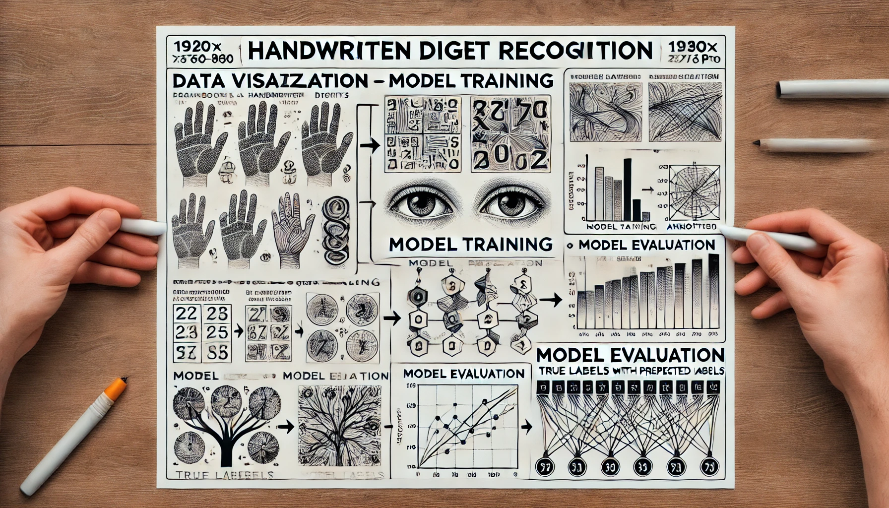

<div style="text-align: center;">
    
</div>


# Handwritten Digit Recognition 

## Description
This project implements a machine learning model to recognize handwritten digits from images. Utilizing popular libraries like TensorFlow and Keras, the project demonstrates image preprocessing, model training, and evaluation, providing an end-to-end solution for digit classification tasks.

## Table of Contents
- [Installation](#installation)
- [Usage](#usage)
- [Project Structure](#project-structure)
- [Contributing](#contributing)
- [License](#license)
- [Contact](#contact)

## Installation
To install the necessary dependencies, clone this repository and install the required packages:

```bash
git clone https://github.com/HoomKh/Handwritten-Digit-Recognition.git
cd Handwritten-Digit-Recognition
pip install -r requirements.txt
```

## Usage
To run the project, execute the Jupyter notebook:

```bash
jupyter notebook Handwritten_Digit_Recognition.ipynb
```

The notebook will guide you through the process of loading the dataset, preprocessing the images, training the model, and evaluating its performance.

## Project Structure
```
Handwritten-Digit-Recognition/
├── data/                      # Dataset folder
├── models/                    # Saved models
├── notebooks/                 # Jupyter notebooks
│   └── Handwritten_Digit_Recognition.ipynb
├── requirements.txt           # Required packages
└── README.md                  # Project readme
```

## Contributing
Contributions are welcome! Please fork this repository and submit a pull request with your changes. For major changes, please open an issue first to discuss what you would like to change.

## License
This project is licensed under the MIT License. See the LICENSE file for more details.

## Contact
Created by [HoomKh](https://github.com/HoomKh) - feel free to contact me!

---
